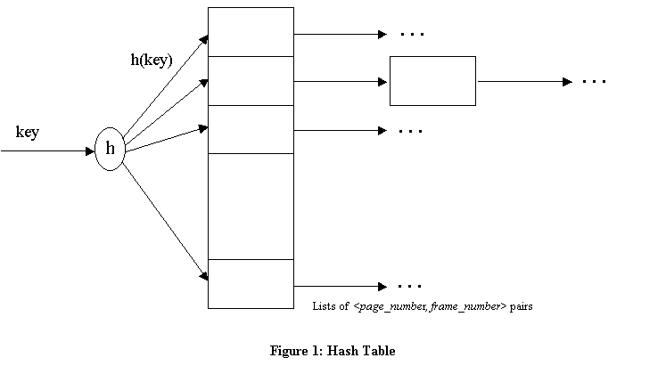

# CSC560-Project3 - Buffer Manager

## Design Overview and Implementation Details  
The buffer pool is a collection of frames (page-sized sequence of main memory bytes) that is managed by the Buffer Manager. It should be stored as an array bufPool[numbuf] of Page objects. In addition, you should maintain an array bufDescr[numbuf] of descriptors, one per frame. Each descriptor is a record with the following fields:
```page number, pin_count, dirtybit``` 

The pin_count field is an integer, page number is a PageId object, and dirtybit is a boolean. This describes the page that is stored in the corresponding frame. A page is identified by a page number that is generated by the DB class when the page is allocated, and is unique over all pages in the database. The PageId type is defined as an integer type in minirel.h.  

A simple hash table should be used to figure out what frame a given disk page occupies.The hash table should be implemented (entirely in main memory) by using an array of pointers to lists of <page number, frame number> pairs. The array is called the directory and each list of pairs is called a bucket. Given a page number, you should apply a hash function to find the directory entry pointing to the bucket that contains the frame number for this page, if the page is in the buffer pool. If you search the bucket and don't find a pair containing this page number, the page is not in the pool. If you find such a pair, it will tell you the frame in which the page resides. This is illustrated in Figure 1:  




The hash function must distribute values in the domain of the search field uniformly over the collection of buckets. If we have HTSIZE buckets, numbered 0 through M-1, a hash function h of the form


works well in practice. HTSIZE should be chosen to be a prime number. When a page is requested the buffer manager should do the following: Check the buffer pool (by using the hash table) to see if it contains the requested page. If the page is not in the pool, it should be brought in as follows:

### Choose a frame for replacement, using the LOVE/HATE replacement policy   
If the frame chosen for replacement is dirty,  flush it (i.e., write out the page that it contains to disk, using the appropriate DB class method).
Read the requested page (again, by calling the DB class) into the frame chosen for replacement; the pin_count and dirtybit for the frame should be initialized to 0 and FALSE, respectively.
Delete the entry for the old page from the Buffer Manager's hash table and insert an entry for the new page. Also, update the entry for this frame in the bufDescr array to reflect these changes.
Pin the requested page by incrementing the pin_count in the descriptor for this frame and return a pointer to the page to the requester.
The Love/Hate replacement policy
Theoretically, the best candidate page for replacement is the page that will be last requested in the future. Since implementing such policy requires a future predicting oracle, all buffer replacement policies try to approximate it one way or another. The LRU policy, for example, uses the past access pattern as an indication for the future. However, sequential flooding can ruin this scheme and MRU becomes more appropriate in this particular situation. In this assignment you are supposed to implement the love/hate replacement policy. The policy tries to enhance prediction of the future by relying on a hint from the upper levels about the page. The upper level user hints the buffer manager that the page is loved if it is more likely that the page will be needed in the future, and hated if it is more likely that the page will not be needed. The policy is supposed to maintain an MRU list for the hated pages and an LRU list for the loved pages. If a page is needed for replacement, the buffer manager selects from the list of hated pages first and then from the loved pages if no hated ones exist.

A situation may arise when a page is both loved and hated at the same time. This can happen if the page was pinned by two different users and then was unpinned by the first one as a hated page and by the other as a loved page. In this case, assume that "love conquers hate", meaning that once a page is indicated as loved it should remain loved. 
