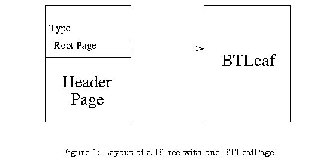
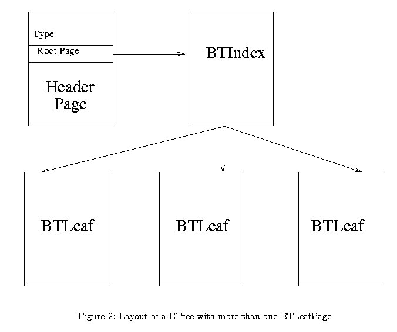

## Btree-Index

### Introduction
In this assignment, you will implement a B+ tree in which leaf level pages contain entries of the form [key, rid of a data record] (Alternative 2 for data entries, in terms of the textbook.) You must implement the full search and insert algorithms as discussed in class. In particular, your insert routine must be capable of dealing with overflows (at any level of the tree) by splitting pages; namely, you do need to implement sibling redistribution when a page splits. Deletes will be handled by simply marking the corresponding leaf entry as ‘deleted’. You do not need to implement merging of nodes on deletes or sibling redistribution on inserts.

You will need to implement SortedPage.C. SortedPage is derived from HFPage, and it augments the insertRecord method of HFPage by storing records on the HFPage in sorted order by a specified key value. The key value must be included as the initial part of each inserted record, to enable easy comparison of the key value of a new record with the key values of existing records on a page. The documentation available in the header files is sufficient to understand what operation each function performs.

You need to implement two page-level classes, BTIndexPage and BTLeafPage, both of which are derived from SortedPage. These page classes are used to build the B+ tree index. You will write code to create, destroy, open and close for a B+ tree index. You will also write code that will open a scan on the B+ tree, allowing its caller to iterate through all of the data entries (from the leaf pages) that satisfy the stated search criterion.

### Getting Started
Download the zip file (cs560-proj4.tar.gz) for project 4 and unzip it (e.g., tar xvfz cs560-proj4.tar.gz) into your working directory (~/).
The files in ~/proj4/btree/include are:

Partial templates for btfile.h, btindex_page.h, btleaf_page.h, sorted_page.h, and btreefilescan.h are there. Also, you can see hfpage.h that should be replaced by your own. You should complete all these .h files (as needed) and also implement the methods in the corresponding .C files (which you will write from scratch) to be listed shortly.
You can find other useful include files bt.h, hfpage.h, sorted_page.h, index.h, test_driver.h, btree driver.h, minirel.h and new_error.h
The files in ~/proj4/btree/src are:

Makefile: A sample Makefile for you to compile your project. Set up any dependencies (as needed) by editing this file. DO NOT change the cLib level It is expected to run as c89.
btfile.C, btindex_page.C btleaf_page.C, btreefilescan.C, key.C, sorted_page.C: Major source code files for B+ tree layer. You should implement the methods in theses files in your own code.
hfpage.C: HFPage soure code. This code should be replaced by your own HFPage code used for Project 1.
buf.C: Buffer manager soure code. This code should be replaced by your own buffer manager code used for Project 3.
main.C, btree_driver.C, keys: B+ tree test driver program and the ASCII key data that will used by the testing program.
expected_output: correct test output

### Design Overview
You should begin by (re-)reading the chapter entitied "Tree Structured Indexing" of the textbook and reviewing the corresponding lecture to get an overview of the B+ tree layer.
#### A Note on 'Keys' for this Assignment
You should note that key values are passed to functions using void * pointers (pointing to the key values). The contents of a key should be interpreted using the AttrType variable. The key can be either a string (attrString) or an integer (attrInteger), as per the definition of AttrType in minirel.h. We just implement these two kinds of keys in this assignment. If the key is a string, it has a fixed length, MAX_KEY_SIZE1, defined in bt.h.

Although the specifications for some methods (e.g., the constructor of BTreeFile) suggest that keys can be of (the more general enumerated) type AttrType, you can return an error message if the keys are not of type attrString or attrInteger.

The SortedPage class, which augments the insertRecord method of HFPage by storing records on a page in sorted order according to a specified key value, assumes that the key value is included as the initial part of each record, to enable easy comparison of the key value of a new record with the key values of existing records on a page. (A DBMS would not write a quadratic time sort algorithm, and you shouldn't either).

#### B+ Tree Page-Level Classes
There are four separate page classes, of which you will implement two. HFPage is the base class (your own), and from it is derived SortedPage. You will derive BTIndexPage and BTLeafPage from SortedPage. Note that, as in the HFPage assignment, you must not add any private data members to BTIndexPage or BTLeafPage.

HFPage: This is the base class. You have already implemented this class in Project 1.

SortedPage: This class is derived from the class HFPage. Its only function is to maintain records on a HFPage in a sorted order. Only the slot directory is re-arranged. The data records remain in the same positions on the page. This exploits the fact that the rids of index entries are not important: index entries (unlike data records) are never ‘pointed to’ directly, and are only accessed by searching the index page.

BTIndexPage: This class is derived from SortedPage. It inserts records of the type [key, pageNo] on the SortedPage. The records are sorted by the key.

BTLeafPage: This class is derived from SortedPage. It inserts records of the type [key, dataRid] on the SortedPage. dataRid is the rid of the data record. The records are sorted by the key. Further, leaf pages must be maintained in a doubly-linked list.
For further details about the individual methods in these classes, look at the header pages for the class.

Lastly, you will need to create a structure to represent the header page of the B+ tree. Despite its name, the data structure used to represent the header page need not be derived from a Page object. It can be implemented simply as a C++ struct, with a field for each piece of information that must be stored in the header page. Just remember to cast pointers to this struct as (Page *) pointers when making calls to functions such as pinPage().

Other B+ Tree Classes
We will assume here that everyone understands the concept of B+ trees, and the basic algorithms, and concentrate on explaining the design of the C++ classes that you will implement.

A BTreeFile will contain a header page and a number of BTIndexPages and BTLeafPages. The header page is used to hold information about the tree as a whole, such as the page id of the root page, the type of the search key, the length of the key field(s) (which has a fixed maximum size in this assignment), etc. When a B+ tree index is opened, you should read the header page first, and keep it pinned until the file is closed. Given the name of the B+ tree index file, how can you locate the header page? The DB class has a method

```Status add_file_entry(const char* fname, PageId header_page_num); ```  
that lets you register this information when a file fname is created. There are similar methods for deleting and reading these ‘file entries’ ([file name, header page] pairs) as well, which can be used when the file is destroyed or opened (See here). The header page contains the page id of the root of the tree, and every other page in the tree is accessed through the root page.

The following two figures show examples of how a valid B+ Tree might look.




Figure 1 shows what a BTreeFile with only one BTLeafPage looks like; the single leaf page is also the root. Note that there is no BTIndexPage in this case.



Figure 2 shows a tree with a few BTLeafPages, and this can easily be extended to contain multiple levels of BTIndexPages as well.

#### IndexFile and IndexFileScan
A BTree is one particular type of index. There are other types, for example a Hash index. However, all index types have some basic functionality in common. We've taken this basic index functionality and created a virtual base class called IndexFile. You won't write any code for IndexFile. However, any class derived from an IndexFile should support IndexFile(), Delete(), and insert(). (IndexFile and IndexFileScan are defined in here).

Likewise, an IndexFileScan is a virtual base class that contains the basic functionality all index file scans should support.

#### BTreeFile
The main class to be implemented for this assignment is BTreeFile. BTreeFile is a derived class of the IndexFile class, which means a BTreeFile is a kind of IndexFile. However, since IndexFile is a virtual base class all of the methods associated with IndexFile must be implemented for BTreeFile. You should have copied btfile.h into your directory, as per the instructions in the Getting Started Section.

#### The methods to be implemented include:

```BTreeFile::BTreeFile```   There are two constructors for BTreeFile (as defined in btfile.h): one that will only open an index, and another that will create a new index on disk, with a given type and key size. Observe that the key type is passed as a value of type AttrType. For this assignment, you only need to handle keys of type attrString and attrInteger. If there is a call with a key whose type is not one of the two, return an error.

```BTreeFile::insert```   The BTreeFile::insert method takes two arguments: (a pointer to) a key and the rid of a data record. The data entry to be inserted---i.e., a ‘record’ in the leaf pages of the BTreeFile ---consists of the pair [key, rid of data record].

If a page overflows (i.e., no space for the new entry), you should split the page. You may have to insert additional entries of the form [key, id of child page] into the higher level index pages as part of a split. Note that this could recursively go all the way up to the root, possibly resulting in a split of the root node of the B+ tree.

```BTreeFile::Delete```   The BTreeFile::Delete routine simply removes the entry from the appropriate BTLeafPage. You are not required to implement redistribution or page merging when the number of entries falls below threshold.

```BTreeFileScan``` 
Finally, you will implement scans that return data entries from the leaf pages of the tree. You will create the scan through a member function of BTreeFile (BtreeFile::new_scan(...) as defined in btfile.h). The parameters passed to new_scan() specify the range of keys that will be scanned in the B+ tree. They are explained in detail in btfile.h.

``` Errors``` 
In the previous projects, you learned how to use the Minibase error protocol. Reviewing it now would be a good idea. In that assignment, all the errors you returned belonged to one of the categories in new error.h, namely BUFMGR. In this assignment, you will need to use BTREE, BTLEAFPAGE, and BTINDEXPAGE.
